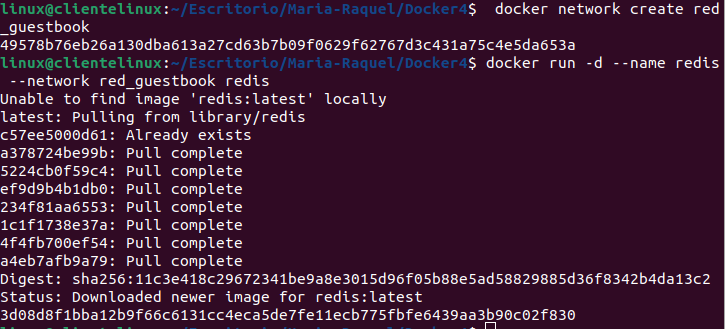
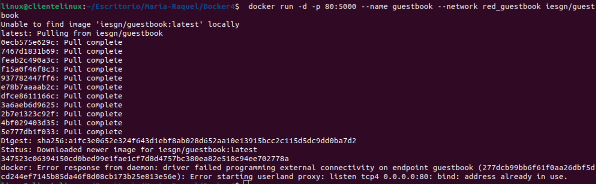
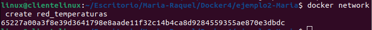
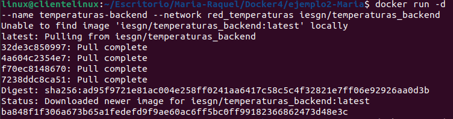
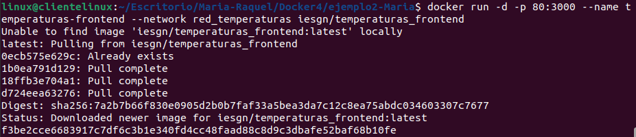

# 4 - Redes en Docker

> Raque Cabezas
>
> María Clemente
>
> Despliegue de Aplicaciones

## Ejemplo 1: Despliegue de la aplicación Guestbook

**Crear una red Docker:**

`$ docker network create red_guestbook`



**Ejecutar el contenedor de Redis:**

`$ docker run -d --name redis --network red_guestbook redis`


**Ejecutar el contenedor de GuestBook:**

`$ docker run -d -p 80:5000 --name guestbook --network red_guestbook iesgn/guestbook`



## Ejemplo 2: Despliegue de la aplicación "Temperaturas"

**Red para conectar los dos contenedores:**

`$ docker network create red_temperaturas`



**Ejecutar los contenedores:**
`$ docker run -d --name temperaturas-backend --network red_temperaturas iesgn/temperaturas_backend`




```bash
docker run -d -p 80:3000 --name temperaturas-frontend --network red_temperaturas iesgn/temperaturas_frontend
```


